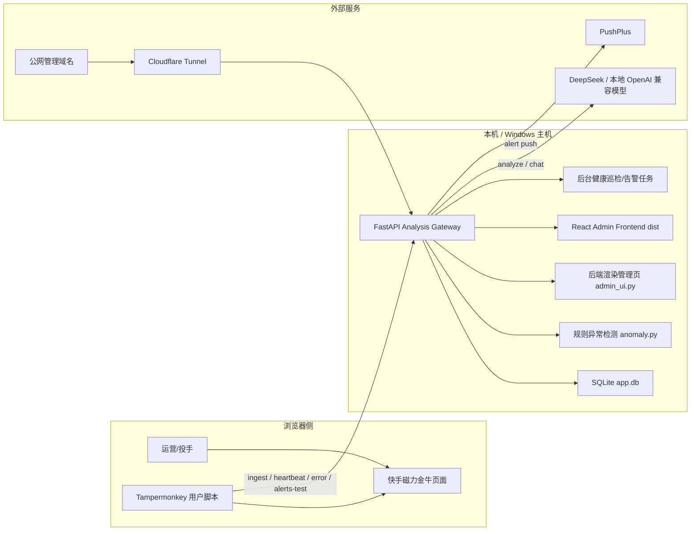
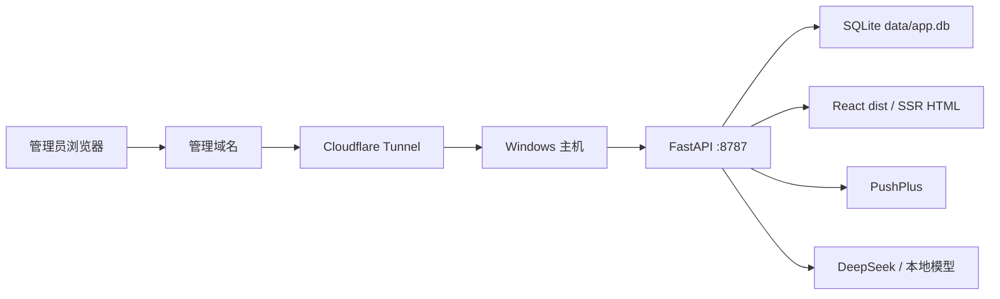

# AdBudgetSentry 架构图说明

## 1. 架构定位

AdBudgetSentry 当前是一个“浏览器端采集 + 本地分析网关 + 本地管理后台 + 外部告警/AI 服务”的单体式监控系统，而不是拆分后的多微服务架构。

系统目标是：

- 在快手磁力金牛页面中持续采集账户消耗数据。
- 在本地网关内完成实例状态管理、异常判定、AI 辅助分析、告警发送与后台展示。
- 通过 Cloudflare Tunnel 将本地管理后台安全暴露到公网。

## 2. 分层视图

## 3. 核心组件

### 3.1 浏览器侧

- `code/userscripts/磁力金牛财务报警助手.user.js`
- 运行在 Tampermonkey 中。
- 在快手页面内抓取消耗金额、账号信息、页面类型、采样历史。
- 本地保存实例 ID、阈值、AI 开关、后端地址、主题等配置。
- 通过 `GM_xmlhttpRequest` 调用分析网关。

脚本侧主要行为：

- 每 `60s` 采样一次页面数据。
- 每 `120s` 上报一次心跳。
- 达到窗口判断条件时请求 `/analyze`。
- 采集失败时上报 `/error`。
- 手工测试告警时调用 `/alerts/test`。

### 3.2 分析网关

- `code/analysis_gateway/app.py`
- 基于 FastAPI。
- 是当前系统的唯一后端入口，承担 API、管理端页面、静态资源分发、AI 调用、告警发送、健康巡检。

主要接口分组：

- 采集接入：`/ingest`、`/heartbeat`、`/error`、`/alert-record`
- 分析能力：`/analyze`
- 管理接口：`/admin/summary`、`/admin/instances`、`/admin/api/*`
- 页面入口：`/`、`/admin`、`/admin/alerts`、`/admin/settings`
- 健康检查：`/health`、`/healthz`、`/readyz`

### 3.3 规则检测

- `code/analysis_gateway/anomaly.py`
- 先做规则层判断，再决定 AI 分析上下文。
- 当前主要判定类型：
  - `surge`
  - `threshold_breach`
  - `stalled`
  - `insufficient_history`

规则逻辑核心：

- 基于历史序列计算分钟增量。
- 使用同小时段样本均值和标准差计算 `z-score`。
- 结合窗口增量和阈值生成风险等级与建议。

### 3.4 数据存储

- `code/analysis_gateway/database.py`
- 默认数据库：`data/app.db`
- 当前使用 SQLite，WAL 模式。

主要表：

- `script_instances`
- `script_heartbeats`
- `capture_events`
- `error_reports`
- `analysis_summaries`
- `alert_records`

这说明当前系统是“单库集中式状态存储”，不是消息队列驱动架构。

### 3.5 管理后台

后台存在两套呈现方式，共用一套后端数据：

- 后端渲染页面：`admin_ui.py`
- React SPA：`code/analysis_gateway/admin_frontend/`

运行逻辑：

- 若 `admin_frontend/dist` 存在，则 `/admin` 等页面优先返回 SPA。
- 若前端构建产物不存在，则自动降级到后端渲染 HTML。

### 3.6 外部集成

- AI 提供方：
  - `deepseek`
  - `local`（OpenAI 兼容接口，如 Ollama `/v1/chat/completions`）
- 告警通道：
  - `PushPlus`
- 公网暴露：
  - `Cloudflare Tunnel`

## 4. 核心数据流

### 4.1 采集与入库

1. 用户打开快手磁力金牛页面。
2. Tampermonkey 脚本从 DOM 中抓取“今日总消耗”等指标。
3. 脚本将采样结果 POST 到 `/ingest`。
4. 网关写入 `capture_events`，并更新 `script_instances`。
5. 网关对该实例执行规则检测与必要的自动分析。

### 4.2 实例健康状态

1. 脚本定期调用 `/heartbeat`。
2. 网关记录最近心跳、最近采集时间、最近错误状态。
3. `database.py` 基于心跳时效、采集状态、连续错误数计算 `green/yellow/red`。
4. 管理后台按实例展示健康状态和最近行为。

### 4.3 AI 辅助分析

1. 脚本或管理端提交分析请求。
2. 网关先运行 `detect_spend_anomaly(...)`。
3. 网关拼接业务上下文、规则证据、历史数据摘要。
4. 通过 `providers.py` 调用 DeepSeek 或本地模型。
5. 返回结构化结果，并可写入 `analysis_summaries`。

### 4.4 告警发送

1. 规则触发、失败重试或手工测试生成告警事件。
2. 网关根据 `config.json` 中的 PushPlus 配置发送消息。
3. 发送结果落库到 `alert_records`。
4. 管理后台可筛选、导出 CSV、查看发送状态。

### 4.5 管理后台访问

1. 公网域名访问 Cloudflare Tunnel。
2. Tunnel 回源到本机 `127.0.0.1:8787`。
3. FastAPI 返回 SPA 或 SSR 页面。
4. 前端再调用 `/admin/api/*` 获取实例、告警、设置、聊天等数据。

## 5. 部署视图

## 6. 画图时的边界约束

为了让架构图和现状一致，建议明确以下约束：

- 不要画成多节点集群；当前核心后端是单个 FastAPI 网关。
- 不要画 Kafka、Redis、MQ；仓库中没有这些中间件。
- 不要画独立的告警服务、调度服务、AI 服务进程；这些逻辑当前都在 `app.py` 内聚合。
- React 管理后台不是独立部署服务，而是由 FastAPI 提供静态产物和回退页面。
- Cloudflare Tunnel 是公网入口，不是业务处理节点。

## 7. 推荐图例

- 蓝色：浏览器侧 / 使用者
- 绿色：本地业务系统
- 橙色：存储与状态
- 紫灰色：外部 SaaS / AI / 通知服务
- 虚线：公网接入链路
- 实线：业务数据流
- 粗线：主链路

## 8. 对应文件

- 架构说明：[架构图说明.md](/E:/Code/AdBudgetSentry/docs/架构图说明.md)
- Draw.io 图：[AdBudgetSentry-architecture.drawio](/E:/Code/AdBudgetSentry/docs/AdBudgetSentry-architecture.drawio)
- Nanobanana 提示词：[nanobanana-架构图提示词.md](/E:/Code/AdBudgetSentry/docs/nanobanana-架构图提示词.md)
