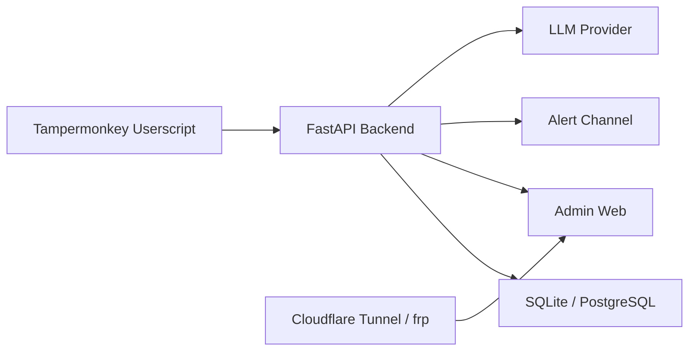

# 部署与运维指南

## 目标
这份文档的目标是把当前项目部署成一套“单机可运行、可外网访问、可观察健康状态”的本地服务器方案。

目标架构如下：



职责边界如下：

- 油猴脚本：只采集、只上报、只发心跳。
- 本地后端：持久化、规则计算、AI 总结、告警发送、后台页面。
- 数据库：保存原始事件、心跳、异常、告警和分析记录。
- 内网穿透：只暴露后台页面和后端 API，不暴露数据库。

## 你现在应该怎么做

建议按下面顺序执行：

1. 先把本机准备成长期运行节点。
2. 再把后端服务跑起来。
3. 再让油猴脚本对接本机后端。
4. 最后再把后台页面暴露给外部用户。

不要一开始就做三件高风险的事：

- 不要先暴露公网地址。
- 不要先上 PostgreSQL。
- 不要先把数据库直接开放给外部访问。

## 推荐的第一版技术选型

### 后端
- `FastAPI`
- `uvicorn`

### 数据库
- 第一版：`SQLite`
- 第二版：`PostgreSQL`

### 后台页面
- 第一版建议：`FastAPI + Jinja2/HTMX` 或简单服务端渲染

原因：

- 你当前仓库已经有 Python 后端雏形。
- 第一版后台重点是“看状态、看记录、看告警”，不是复杂交互系统。
- 先避免引入 `Node.js + 前端打包链 + 额外部署复杂度`。

### 外网访问
- 第一优先：`Cloudflare Tunnel`
- 第二优先：`frp`

## 需要下载和安装什么

### 必装

| 组件 | 用途 | 备注 |
| --- | --- | --- |
| Python 3.12+ | 运行后端 | 推荐 3.12 或 3.13 |
| Git | 拉取和更新仓库 | Windows 版即可 |
| 浏览器 | 运行油猴脚本、访问后台 | 建议 Chrome 或 Edge |
| Tampermonkey | 安装油猴脚本 | 浏览器扩展 |
| cloudflared | 外网访问后台页面 | 推荐方案 |

### 可选

| 组件 | 用途 | 何时需要 |
| --- | --- | --- |
| DB Browser for SQLite | 查看 SQLite 文件 | 你想直接看数据库内容时 |
| PostgreSQL | 替代 SQLite | 并发和数据量明显增大时 |
| pgAdmin | 管理 PostgreSQL | 用 PostgreSQL 时 |
| frp | 备选内网穿透 | 你有公网 VPS 时 |

### 官方参考

- [Cloudflare Tunnel 文档](https://developers.cloudflare.com/tunnel/)
- [Cloudflare Tunnel 下载](https://developers.cloudflare.com/cloudflare-one/networks/connectors/cloudflare-tunnel/downloads/)
- [Cloudflare Windows 服务](https://developers.cloudflare.com/cloudflare-one/connections/connect-networks/do-more-with-tunnels/local-management/as-a-service/windows/)
- [Cloudflare Access 自托管应用](https://developers.cloudflare.com/cloudflare-one/access-controls/applications/http-apps/self-hosted-public-app/)
- [frp 文档](https://gofrp.org/en/docs/)
- [frp 概览](https://gofrp.org/en/docs/overview/)
- [SQLite](https://www.sqlite.org/about.html)
- [PostgreSQL Windows 下载](https://www.postgresql.org/download/windows/)

## 为什么当前优先选 SQLite

第一版建议直接用 `SQLite`。

原因很实际：

- Python 自带 `sqlite3`，不需要额外部署数据库服务。
- 你的当前场景是单机采集、单机分析、少量后台查看。
- 数据库直接是一个文件，备份最方便。
- 部署复杂度最低。

### SQLite 适用场景

- 只有一台 Windows 电脑在跑服务。
- 后端写入频率不算夸张。
- 后台访问用户很少。
- 现阶段目标是先跑通采集、入库、监控和展示。

### 什么时候再切 PostgreSQL

满足下面任意两个条件时再考虑：

- 多人同时频繁访问后台页面。
- 采集实例明显增多。
- 需要更复杂的统计查询。
- 需要更成熟的权限管理和备份体系。
- 需要把服务拆成多进程或多节点。

### 当前不建议

- 不建议一开始用 MySQL。
- 不建议一开始装完整数据库集群。
- 不建议让油猴脚本直接连数据库。

## 电脑作为服务器前的系统准备

如果这台机器要长期作为服务器，先做这些设置：

### 1. 关闭睡眠

需要确保：

- 屏幕可以关闭
- 但系统不能自动睡眠
- 硬盘不能自动休眠

否则浏览器标签页、油猴脚本、后端和 tunnel 都会被中断。

### 2. 确保稳定网络

- 尽量使用有线网络。
- 如果只能用 Wi-Fi，避免频繁切换网络。

### 3. 规划目录

建议最终形成这样的目录：

```text
E:\Code\AdBudgetSentry\
  code\
  docs\
  data\
    app.db
    backups\
  logs\
  scripts\
```

### 4. 规划运行账号

建议后端和 tunnel 使用固定 Windows 用户运行，避免换账号后路径失效。

## 本地后端怎么运行

当前仓库已有 Python 后端雏形，目录在 `code/analysis_gateway/`。

### 运行步骤

在项目根目录执行：

```powershell
python -m venv .venv
.\.venv\Scripts\Activate.ps1
pip install -r code\analysis_gateway\requirements.txt
Copy-Item code\analysis_gateway\config.example.json code\analysis_gateway\config.json
python code\analysis_gateway\app.py
```

默认本地访问地址是：

```text
http://127.0.0.1:8787
```

### 当前建议的监听方式

- 后端只监听 `127.0.0.1`
- 不直接监听公网 IP
- 不直接把数据库端口暴露出去

这是因为外网访问应当交给 tunnel，而不是让本机直接裸露。

## 建议新增的本地配置

虽然当前仓库还没有完整的部署配置体系，但从运维角度建议尽快补充：

- `data/` 数据目录
- `logs/` 日志目录
- `.env` 或等价配置文件
- 数据库路径配置
- 签名密钥配置
- 管理后台登录配置

### 最小配置项建议

- `ADBUDGET_HOST=127.0.0.1`
- `ADBUDGET_PORT=8787`
- `ADBUDGET_DB_PATH=E:\Code\AdBudgetSentry\data\app.db`
- `ADBUDGET_SHARED_SECRET=...`
- `ADBUDGET_ADMIN_USERNAME=...`
- `ADBUDGET_ADMIN_PASSWORD=...`

## 如何让外部用户访问后台页面

### 推荐方案：Cloudflare Tunnel

这是当前最推荐的方案。根据 Cloudflare 官方文档，`cloudflared` 通过仅出站连接把本地服务映射到 Cloudflare 网络，不需要开放入站端口；另外公开应用可以直接通过 public hostname 访问，若需要身份验证，可再叠加 Cloudflare Access 保护。

适合你的原因：

- 不需要家里宽带有固定公网 IP。
- 不需要路由器做端口映射。
- 不需要直接暴露本机真实公网地址。
- 可以先开放后台页面，再逐步加安全策略。

### 使用前提

- 你有一个托管在 Cloudflare 的域名。
- 你的本地后端已经能在 `127.0.0.1:8787` 正常打开。

### 推荐暴露的地址

- 后台页面：`https://admin.example.com`
- 可选 API：`https://admin.example.com/api/...`

不建议：

- 单独暴露数据库端口
- 暴露没有鉴权的写接口

### 典型步骤

下面给出一套常见命令流程，具体参数以官方文档为准：

1. 安装 `cloudflared`

```powershell
winget install --id Cloudflare.cloudflared
```

2. 登录 Cloudflare

```powershell
cloudflared tunnel login
```

3. 创建 tunnel

```powershell
cloudflared tunnel create adbudgetsentry
```

4. 绑定域名

```powershell
cloudflared tunnel route dns adbudgetsentry admin.example.com
```

5. 编写 `config.yml`

建议放在：

```text
%USERPROFILE%\.cloudflared\config.yml
```

示例：

```yaml
tunnel: <你的 tunnel UUID>
credentials-file: C:\Users\<你的用户名>\.cloudflared\<你的 tunnel UUID>.json

ingress:
  - hostname: admin.example.com
    service: http://127.0.0.1:8787
  - service: http_status:404
```

6. 本地测试运行

```powershell
cloudflared tunnel run adbudgetsentry
```

7. 确认没问题后，安装为 Windows 服务

```powershell
cloudflared service install
```

Cloudflare 官方 Windows 服务文档说明，运行为服务时，至少要在配置文件里包含 `tunnel` 和 `credentials-file`。

### 强烈建议再加一层 Access

如果后台是给外部用户访问，不建议 tunnel 建好后直接裸露。Cloudflare 官方文档也建议在公开应用前先配置 Access 保护，否则应用会直接对互联网公开。

推荐做法：

- `admin.example.com` 放在 Cloudflare Access 后面
- 先要求登录
- 再让用户进入后台页面

### 什么时候选择 frp

如果你已经有公网 VPS，`frp` 也可以。

适合场景：

- 你想完全掌控流量路径
- 你已经维护一台公网服务器
- 你希望同时穿透多个自建服务

基本结构：

- 公网 VPS 跑 `frps`
- 本地 Windows 机器跑 `frpc`
- `frps` 再把流量转到本地 `127.0.0.1:8787`

但从运维成本上说，当前仍然推荐先用 Cloudflare Tunnel。

## 不推荐的公网暴露方式

### 直接路由器端口映射

不建议直接把本机 `8787` 端口映射到公网。

原因：

- 暴露面太大
- 家庭宽带 IP 可能变动
- 证书、DNS、访问控制都要自己扛
- 后台页面一旦有漏洞，风险会直接打到本机

## 后台页面应当怎么保护

后台页面最少要做两层保护：

1. 网络入口保护
2. 应用层登录保护

### 网络入口保护

- Cloudflare Tunnel
- 可选 Cloudflare Access
- 只暴露后台和必要 API

### 应用层保护

- 后台登录账号密码
- 会话过期
- 审计日志
- 不同角色可见范围区分

### 写接口保护

所有写接口都应当校验：

- `instance_id`
- `timestamp`
- `nonce`
- `signature`

签名建议：

- 共享密钥
- `HMAC-SHA256`

后端要做：

- 时间戳过期校验
- 重复 `nonce` 拒绝
- 签名错误拒绝

## 油猴脚本健康检查该怎么设计

这是这套系统里非常关键的部分。

你要监控的不是“数据有没有变化”，而是三件不同的事：

1. 脚本还活着吗
2. 页面采集还成功吗
3. 数据上报链路还通吗

### 建议分三类上报

#### 1. `heartbeat`

用途：说明脚本实例还在运行。

建议频率：

- 每 2 分钟一次

建议字段：

- `instance_id`
- `script_version`
- `page_url`
- `heartbeat_at`
- `browser_visible`
- `last_capture_at`
- `capture_status`
- `last_error`

#### 2. `ingest`

用途：说明本次采集成功并附带业务数据。

建议字段：

- `account_id`
- `account_name`
- `page_type`
- `captured_at`
- `metrics`
- `row_count`

#### 3. `error`

用途：说明脚本在采集或上报过程中出错。

建议字段：

- `instance_id`
- `error_type`
- `error_message`
- `occurred_at`

## 健康状态判定规则

建议后台统一计算三色状态。

### Green

同时满足：

- 5 分钟内有心跳
- 10 分钟内有成功采集
- 连续失败次数为 0

### Yellow

满足任一：

- 仍有心跳，但超过 10 分钟没有成功采集
- 最近存在间歇性错误
- 脚本版本过旧

### Red

满足任一：

- 超过 10 分钟没有心跳
- 连续失败达到阈值
- 后端多次拒绝该实例上报

## 后台页面至少要显示什么

### 总览页

- 当前在线实例数
- Yellow 实例数
- Red 实例数
- 最近 24 小时异常数
- 最近 24 小时告警数

### 实例页

- `instance_id`
- 当前脚本版本
- 最近心跳时间
- 最近成功采集时间
- 最近错误信息
- 连续失败次数
- 当前状态颜色
- 当前页面 URL

### 账号页

- 最新采集指标
- 历史趋势
- 最近异常
- 最近 AI 结论

## 推荐的最小可行部署

这是当前最适合落地的一版：

1. 安装 Python、Git、Tampermonkey、cloudflared。
2. 后端继续使用当前 `FastAPI` 项目。
3. 数据库先用 `SQLite`。
4. 油猴脚本改成只做采集、上报、心跳。
5. 后端新增 `ingest`、`heartbeat`、`error` 接口。
6. 后端新增数据库表保存采集和健康状态。
7. 后端新增一个简单后台页面。
8. 用 Cloudflare Tunnel 暴露后台页面。
9. 用后台页面观察实例健康和异常。
10. 稳定后再考虑 PostgreSQL 和更复杂的前端。

## 建议的运维基线

### 每天检查

- 后台页面是否可打开
- 最近心跳是否正常更新
- 最近成功采集时间是否正常
- 是否出现大量连续失败

### 每周检查

- 数据库文件是否备份
- 日志是否过大
- `cloudflared` 是否需要更新
- 油猴脚本版本是否统一

### 每次升级后检查

- 本地后端是否还能启动
- Cloudflare Tunnel 是否还能通
- 后台页面是否还能登录
- 油猴上报接口是否还能写入

## 你下一步最该做的事

如果按优先级只列最关键的动作，顺序如下：

1. 把油猴脚本职责缩到“采集 + 上报 + 心跳”。
2. 在后端落 SQLite。
3. 做 `heartbeat` 和 `ingest` 接口。
4. 做实例健康页。
5. 把后台先在本机跑通。
6. 再接 Cloudflare Tunnel。
7. 最后再补 AI 总结和高级告警。
